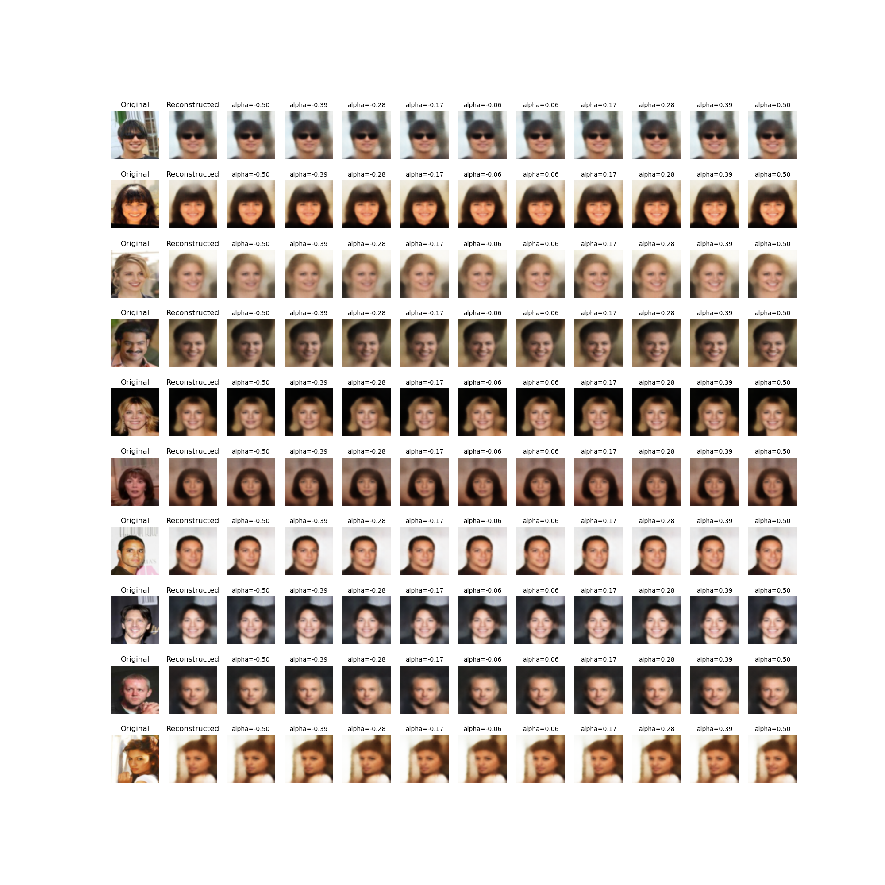

# Variational AutoEncoder
Implement a variational AutoEncoder in PyTorch to encode CelbA dataset into a probabilistic latent space. After that, we can determine the direction of given feature vector (smiling feature used in this example) by calculating the average of labels that contain said features and average of  labels without this feature. The difference between these two will give the vector direction. Then take any image, use encoder to get the latent space representation and then to add or subtract the feature(smiling in this case), move in latent space along or against the feature vector calculated.
To use this, first modify architecture if needed (maybe remove some layers depending on your GPU specs or add more convolutions if you have larger dataset with more complex features - optional step) and then run the `VAE.py` with different hyper-parameters (the important part is to figure out $$  \beta $$ for KLD term that gives good result for both reconstruction and sampling in latent space). Then use a saved checkpoint as input to run `edit_facial_features.py` file. Edit the feature ID if you want to try some other feature instead of `smiling`. `alpha list` defines list of weights that determines how much to push given image in or against the direction of feature vector.

## Sample Result

First column shows original image, second column shows reconstructed images and then other column shows faces as we move along (positive alpha) or against (negative alpha) in the direction of feature vector in the latent space and then reconstruct the image.

# NOTES

resources: The idea for this project was inspired from VAE chapter in **Generative Deep Learning book by David Foster (O' Reilly)**

dataset used: CelbA

for architecture , see out*.dat flie and subroutines.py

hyperparameters are mentioned in params.py and log files
